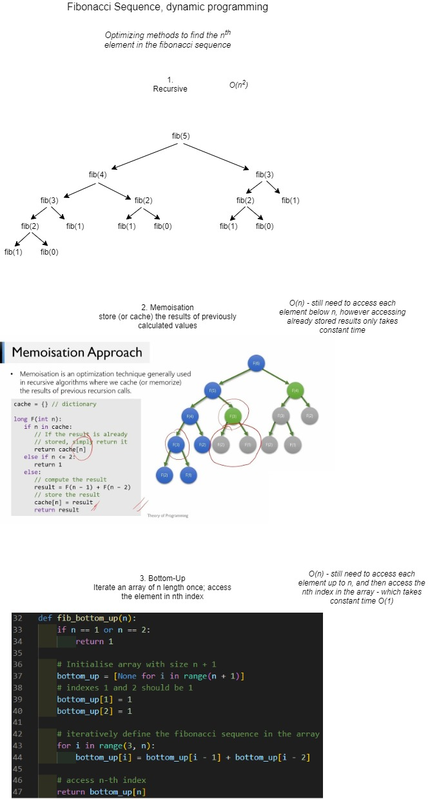

# Dynamic Programming

Fibonacci program has 3 methods of finding the nth element in the fibonacci sequence.

- Recursion: accessing the 30th element will take atleast 2 seconds.
  - **O(n^2)**
- Memoization and Bottom-Up approach: accessing the 900th element takes < 0.01s most of the time on my PC. Python stops the program at the recursion limit (depth ~1000)
  - **O(n)**

