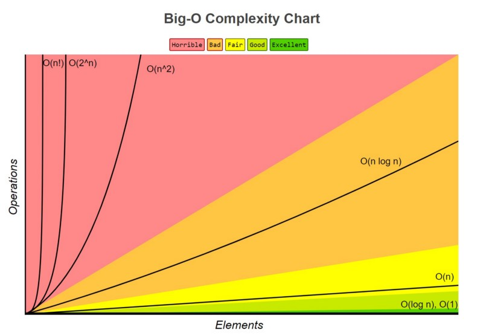

# Algorithms Overview

In this folder:

- Notes on Dynamic Programming: _/dynamic-prog_
- Notes on Searching Algorithms: _/searching_
- Notes on Sorting Algorithms: _/sorting_
- Notes on Data Structures: _/data-structures_

## Contents

- [Time/Space Complexity](#complexity)

  - [Time Complexity](#time-complexity)
  - [Space Complexity](#space-complexity)

- [Constant Complexities](#constant)
- [Linear Complexities](#linear)
- [Quadratic Complexities](#quadratic)
- [Logarithmic Complexities](#logarithmic)

## Time/Space Complexity<a name='complexity'></a>

How the complexity of an algorithm influences the time or space it takes to complete it's task. Use Big O notation to represent complexities.

_O(n)_ – where O is the order of magnitude (time / space), and n is the amount of data. So as _n_ grows, so will _O_. The degree to which O grows according to n determines if it is a fast or slow algorithm.



### Time Complexity<a name='time-complexity'></a>

The time it takes for the algorithm to finish, compared with the number of elements.

### Space Complexity<a name='space-complexity'></a>

The space, in memory, which the algorithm needs to complete the set task. As the number of elements increases, so too can the memory requirement. However, this is not true for in-place algorithms which need no extra memory.

e.g. the merge sort algorithm requires more memory as it is a 'divide-and-conquer' algorithm; it divides the data set into many smaller data sets. It's time complexity is _O(n)_

On the other hand, bubble sort requires no extra memory, so it can be referred to as an in-place algorithm; it's space complexity will be _O(1)_

#### Constant complexity – _O(1)_<a name='constant'></a>

No matter the input length, the algorithm's run time/required memory will stay the same.

This function is of constant complexity:

```
void constantPrint(int \*array) {
  printf(“%i”, array[i]);
}
```

#### Linear complexity – _O(n)_<a name='linear'></a>

The run time or memory required will increase as the input length, n, increases.

Consider this function:

```
void printArray(int \*array) {
  int n = sizeof(array) / sizeof(int);

  for (int i = 0; i < n; i++) {
    printf(“[%i]: %i”, i, array[i]);
  }
}
```

#### Quadratic complexity – _O(n^2)_<a name='quadratic'></a>

Requires a number of steps equal to the square of the input length.

The following function is of quadratic complexity, as it iterates n^2 times

```
void overlyComplexFunction(int *array) {
  int n = sizeof(array) / sizeof(int);
  for (int x = 0; x < n; x++)
    for (int y = 0; y < n; y++)
      printf(“X:%i Y:%i”, x, y);
}
```

#### Logarithmic complexity – _O(log n)_<a name='logarithmic'></a>

Those algorithms with logarithmic time complexity are often the best suit for large data sets.

Binary search is an example of a logarithmic algorithm, as the data being searched gets half as long each iteration, making it quicker each subsequent step. “Each iteration, the time to find the target element is decreased by a magnitude inversely proportional to n”
