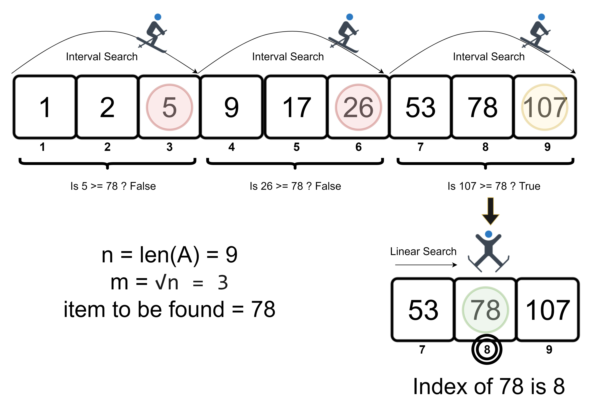

# Searching Algorithms

- [Searching](#searching)
  - [Linear Search](#linear-search)
  - [Binary Search](#binary-search)
  - [Jump Search](#jump-search)

## Searching<a name='searching'></a>

### Linear Search<a name='linear-search'></a>

A very inefficient way of searching. Should only be used for small data sets, as this technique requires each element to be compared when iterating through the whole set.

```
int search(int array[], int target) {
  for (int i = 0; i < array.length; i++) {
    if (array[i] == target) {
      return i; // found index of the target in the array
    }
  }
  return -1; // not found
}
```

**_Time Complexity_**
| Memory | Best-Case | Average-Case | Worst-Case |
| ------ | --------- | ------------ | ---------- |
| O(1) | O(1) | O(n / 2) | O(n) |


### Binary Search<a name='binary-search'></a>

To perform a binary search, the data set must already be sorted. A binary search will split the data in halves each iteration, choosing the portion which the target is in. Because of this, it's a very efficient search algorithm, as even with large data sets you will have a low time complexity. This algorithm can be implemented iteratively or recursively.

| Memory | Best-Case | Average-Case | Worst-Case |
| ------ | --------- | ------------ | ---------- |
| O(1)   | O(1)      | O(log n)     | O(log n)   |


### Jump Search<a name='jump-search'></a>

The Jump Search is similar to a linear search, just with extra steps. First, the data set must be sorted. The Jump Search works by jumping through the data, then going back when the current value is greater than the target. Instead of stepping one index at a time, the amount of indexes to jump depends on the number of elements, and is usually the square root of n.

| Memory | Best-Case | Worst-Case |
| ------ | --------- | ---------- |
| O(1)   | O(1)      | O(√n)      |


