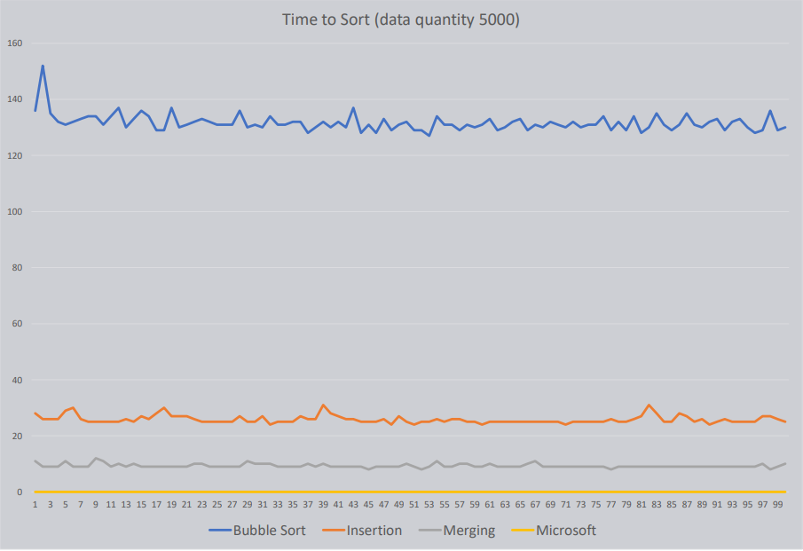

# Sorting.exe

Running a sorting method will spit out the time (in ms) taken to sort the data into txt files. The program performs a number of sorts, resetting the data inbetween each time. The more tests ran the more reliable the data will be (for your system). You can find the results of the sorts in milliseconds printed in the txt files.

- bubble_sort.txt - Bubble Sort
- insertion_sort.txt - Insertion Sort
- merging_sort.txt - Merge Sort
- ms_sort.txt - Microsoft Sort

[Microsoft's Sorting algorithm](https://stackoverflow.com/questions/1854604/which-sorting-algorithm-is-used-by-nets-array-sort-method) usually uses Quicksort (a partitioning algorithm), but depending on the [partition size](https://stackoverflow.com/questions/18181210/what-is-the-number-of-partitions-and-range-of-an-array) may choose Insertion or Heapsort.
IntroSort - a way to optimize time complexity

Results for my system

