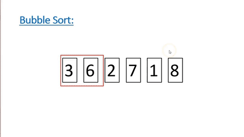

# Sorting Algorithms

- [Sorting](#sorting)
  - [Insertion Sort](#insertion-sort)
  - [Bubble Sort](#bubble-sort)
  - [Selection Sort](#selection-sort)
  - [Merge Sort](#merge-sort)
  - [Quick Sort](#quick-sort)

## Sorting

There are many algorithms for sorting data. [See a comparison of the most used algorithms](https://en.wikipedia.org/wiki/Sorting_algorithm#Comparison_sorts).
There are different classifications of algorithms, including Exchanging, Merging, Insertion, Selection and Partitioning. The algorithm you choose can depend on your memory availability and the order(s) you want to sort by.

When an algorithm is stable, this means that if there are duplicate values in a set, the duplicates will stay in their original order. Sometimes, you may need to sort a set of data by two values, e.g. if a Student (object) has the fields Name and Classroom, you want the Classroom field to be sorted first, and then you want the students to be sorted alphabetically within their class. This is when you need to use a Stable algorithm.

_First, the students are sorted by Name, alphabetically. Then they are sorted by Classroom, which should result in every student from Class A being listed at the top, alphabetically, and so on._

_See the difference below of a Stable vs Unstable algorithm when sorting by Classroom, then Student Name._

| Unstable algorithm result        | Stable algorithm result |
| -------------------------------- | ----------------------- |
| Carol, A                         | Carol, A                |
| Dave, A                          | Dave, A                 |
| Ken, A                           | Ken, A                  |
| Eric, B                          | Alice, B                |
| Alice, B (should be before Eric) | Eric, B                 |

Since a stable algorithm will ignore when two values are the same, it becomes possible to sort by multiple values. On the other hand, an unstable algorithm will not ignore when two values are the same, and can produce inconsistencies.

### Insertion Sort

**Insertion** sort virtually splits the data into a sorted and unsorted part. The values from the unsorted part are taken and placed into the sorted part, similar to how we sort playing cards in our hands.

| Stable? | Memory | Best-Case | Average-Case | Worst-Case |
| ------- | ------ | --------- | ------------ | ---------- |
| Yes     | O(1)   | O(n)      | O(n^2)       | O(n^2)     |

### Bubble Sort

Is an **exchanging** method of sorting. It isn't a very efficient algorithm for medium-large data sets. It works by comparing adjacent elements and swapping them if they are in the wrong order.

| Stable? | Memory | Best-Case | Average-Case | Worst-Case |
| ------- | ------ | --------- | ------------ | ---------- |
| Yes     | O(1)   | O(n)      | O(n^2)       | O(n^2)     |

### Selection Sort

Should only really be used on smaller data sets, in environments where memory is limited.

Similar to the insertion sort, it divides the set into sorted and unsorted parts. It scans from left to right, picking the smallest value from the unsorted part and placing it on the end of
the sorted part.

| Stable? | Memory | Best-Case | Average-Case | Worst-Case |
| ------- | ------ | --------- | ------------ | ---------- |
| No      | O(1)   | O(n^2)    | O(n^2)       | O(n^2)     |

### Merge Sort

Most implementations are stable. It works by dividing the unsorted set into _n_ subsets, each containing one value, as a list with only one element is considered to be sorted. Then you repeatedly merge the subsets to produce new sorted sets. Do this until there is only one set remaining. There are multiple variants of the merge sort.

As you'd expect, this takes a decent amount of memory, especially for larger data sets.

| Stable? | Memory | Best-Case  | Average-Case | Worst-Case |
| ------- | ------ | ---------- | ------------ | ---------- |
| Yes     | O(n)   | O(n log n) | O(n log n)   | O(n log n) |

### Block Sort

There is an in-place variant of merge sort named Block Sort, or Block Merge Sort which combines merge operations with insertion sort. It is stable, and is better suited for large data sets when compared to the generic merge sort.

| Stable? | Memory | Best-Case | Average-Case | Worst-Case |
| ------- | ------ | --------- | ------------ | ---------- |
| Yes     | O(1)   | O(n)      | O(n log n)   | O(n log n) |

### Quick Sort

An in-place algorithm which uses partitioning. See below the basic concept of a partition algorithm;

When implemented well, QuickSort can be faster than merge sort and heap sort. The most common implementation is not stable, however there are variations which can be. Below is a QuickSort on a large data set. The red is a pivot point.

| Stable? | Memory | Best-Case  | Average-Case | Worst-Case |
| ------- | ------ | ---------- | ------------ | ---------- |
| No      | O(1)   | O(n log n) | O(n log n)   | O(n^2)     |
