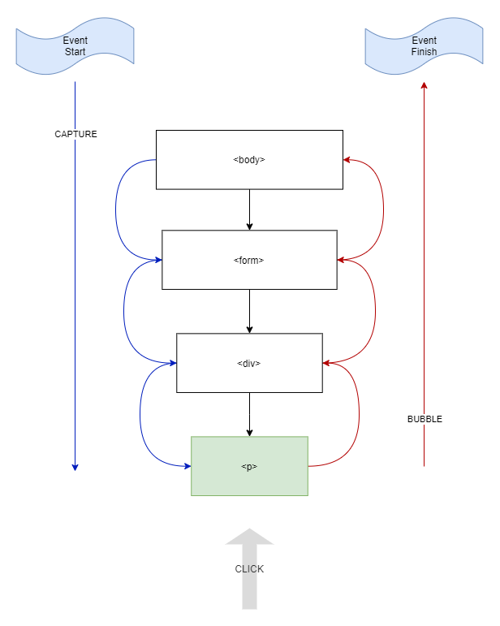

# The Document Object Model

---

- [Tree Structure](#tree-structure)
- [DOM Manipulation](#dom-manipulation)
  - [XPath](#xpath)
  - [Access DOM Elements](#access-dom-elements)
  - [DOM Element Properties](#dom-element-properties)
    - [Classlist](#classlist)
  - [Children](#children)
  - [Create a Node](#create-a-node)
  - [Adding Elements](#adding-elements)
  - [Events](#events)
    - [Bubbling Phase](#bubbling-phase)
    - [Capture Phase](#capture-phase)
  - [Overview of Event Phases](#overview-of-phases)

## Tree Structure

An XML or HTML document is structured like a tree, where each tag (object) is a child node of the parent container.

In XML, the root node can be named `<anything>`, whereas HTML uses `<html>`.

Consider the following HTML document:

```html
<html>
	<head>
		<title></title>
		<link />
		<style></style>
	</head>

	<body>
		<main>
			<div>
				<h1></h1>
				<p></p>
			</div>
		</main>
	</body>
</html>
```

And represented as a tree:


## DOM Manipulation

The DOM is available to alter how you like with the power of JavaScript.
Elements can be accessed via an id, class, tag, or xpath/css selectors.

### XPath

...is a querying technique used to select node(s) within a DOM. It is essentially the location of the element within the HTML document. To access this location, you have to traverse the DOM tree starting from the root. While you may not come across XPath often in web development, it's good to know, especially if you're planning to build a [web scraper](https://realpython.com/beautiful-soup-web-scraper-python/#what-is-web-scraping)

Consider the simple HTML page, `xpath.html` located in this folder. When viewed in the browser, it shows a simple unordered list with 3 items. With the Dev tools inspector open, you can see the layout:


Note the text at the bottom,
`html > body > main > div > ul > li`
This is the location of the highlighted list item

The equivalent XPath would be:
`/html/body/main/div/ul/li[1]`
`[1]` - meaning the first list item

_Don't confuse the starting index with that of arrays; XPath and CSS Selectors start at 1 rather than 0_

### Access DOM Elements

Elements can be searched for within the document itself or within an element,

```js
// access via id attribute
const myDiv = document.getElementById('myDiv')

// access via class name
document.getElementsByClassName('myClass')
// returns HTMLCollection

// access via CSS selectors
document.querySelector('#myDiv')
document.querySelector('body > #myDiv')

// same as above, but instead of finding the first appearance,
//  get all appearances
document.querySelectorAll('#myDiv')
// returns HTMLCollection

// can also search within a node!
//  note that all search functions except
//  getElementById will work for searching within a node
myDiv.querySelector('someText')
```

**Note:**
`getElementById()` is about 2x faster than `querySelector()`. While this difference is still negligible, as both run extremely fast, it is best to avoid performing `querySelector()` calls in bulk.

---

`querySelector()` vs `getElementById()`

> [CodeSandbox benchmark](https://codesandbox.io/s/benchmark-queryselector-kx2vf?file=/src/index.js)

> [Benchmarking via measurethat.net`](https://www.measurethat.net/Benchmarks/Show/2488/0/getelementbyid-vs-queryselector)


---

Searching via XPath:

```js
const nodes = document.evaluate(
	'/html/body/main/div/ul/li',
	document,
	null,
	XPathResult.ANY_TYPE,
	null
)

const firstItem = nodes.iterateNext()
```

### DOM Element Properties

[View all on w3schools](https://www.w3schools.com/jsref/dom_obj_all.asp)

Common members (functions/properties) of DOM elements you may use are:

```ts
// listen for any event relevant to the element
element.addEventListener(event: string, handler: Function, useCapture: boolean)

// focus
element.focus()

// lose focus
element.blur()

element.children:   Array
element.classList:  Array
element.id:         string
element.innerText:  string
element.innerHTML:  string
```

#### Classlist

Classes can be added/removed via

```js
element.classList.add('foo')
element.classList.remove('foo')

// add if necessary, otherwise remove
element.classList.toggle('foo')

// returns boolean
//  true - the class exists on the element
//  false - class does not exist on the element
element.classList.contains('foo')
```

### Children

```js
const element = document.getElementById('myDiv')

const children = element.childNodes
// access parent node from children
const parent = children[0].parentNode
```

### Create a Node

```js
const heading = document.createElement('h1')
// can get/set any DOM properties
heading.innerText = 'Hello World!'
```

### Adding Elements

View the result of the below code:


And the code needed to create this div, along with all it's children:

```js
const myDiv = document.createElement('div')
// append div to body
document.body.appendChild(myDiv)

const paragraph = document.createElement('p')
paragraph.innerText = 'This is a paragraph'
// append paragraph to div
myDiv.appendChild(paragraph)

const heading = document.createElement('h1')
heading.innerText = 'This is a heading'
// insert heading before paragraph
myDiv.insertBefore(heading, paragraph)

const subTitle = document.createElement('h2')
subTitle.innerText = 'Subtitle'
// view position names below
heading.insertAdjacentElement('afterend', subTitle)
```

```html
<!-- "beforebegin": before the .target -->
<div class="target">
	<!-- "afterbegin": inside the .target, before first child -->
	foo
	<!-- "beforeend": inside the .target, after last child -->
</div>
<!-- "afterend": after the .target -->
```

### Events

You can listen to events on any DOM element, even the window itself.

```js
window.addEventListener('click', () => {
	// do something
})
```

When a click is performed, it will be handled by the window event listener. Regardless of what is clicked, as long as it's a child of the window.

#### Bubbling Phase

When clicking an element, the event will "bubble", i.e. be triggered in an upward fashion on each parent element, until it reaches the topmost element. Consider the codesandbox example:

[View CodeSandbox Demo](https://codesandbox.io/s/bubbling-rkfdx?file=/index.html)


When the `p` is clicked, the first function to be triggered is the 'p'. When this has completed, 'div' will be triggered, and lastly 'form'.

##### `e.stopPropagation()`

This line halts the event flow. If you're in the bubbling phase, it will stop any events being fired after you call this function. You'll see in the [CodeSandbox](https://codesandbox.io/s/bubbling-rkfdx?file=/index.html) link I've left the line `e.stopPropagation()` commented.

##### `e.stopImmediatePropagation()`

Performs the same task as `e.stopPropagation()`, however, if there are multiple events attached to one element, it will stop these events being fired as well.

##### `e.target`

`e.target` represents the element which was actually clicked. If the `p` was clicked and you use the value of `e.target` in the `form` listener, it will contain the `p` DOM node.

#### Capturing Phase

Is like the opposite of bubbling. While bubbling goes up the DOM tree, capturing occurs before any bubbling and goes down the DOM tree. The capture phase happens before the bubbling phase. To register a capture event you add `true` as an option after your event callback:

```js
element.addEventListener('click', () => {}, { capture: true })

// or simply:

element.addEventListener('click', () => {}, true)
```

#### Overview of Phases



---

References

- [thegitfather - github](https://gist.github.com/thegitfather/9c9f1a927cd57df14a59c268f118ce86/)
- [MDN](https://developer.mozilla.org/en-US/docs/Web/API/Element/insertAdjacentElement)
- [W3Schools](https://www.w3schools.com/jsref/dom_obj_all.asp)
- [Bubbling and capturing - javascript.info](https://javascript.info/bubbling-and-capturing)
