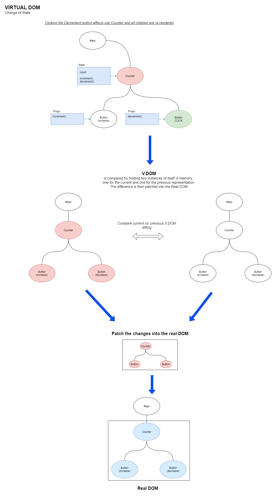

# Virtual DOM, the Foundation of ReactJS

Keywords:

- `DOM` - Document Object Model
  - It is the underlying tree structure of an HTML/XML document. Each object/HTML tag is seen as an object.

The concept of a virtual DOM is where an accurate representation of the DOM is kept in memory _(as a JavaScript object)_ to be synced with the real DOM upon component updates. It is an essential part of React and allows the encapsulation of state in UI components.

When data is changed in a React component, the virtual DOM is queried to find all child components which need to be updated. It would be tedious and a serious detriment to performance to do this sort of operation on the real DOM. The difference between the newly rendered current V.DOM and the previous V.DOM then gets 'patched' into the real DOM.

